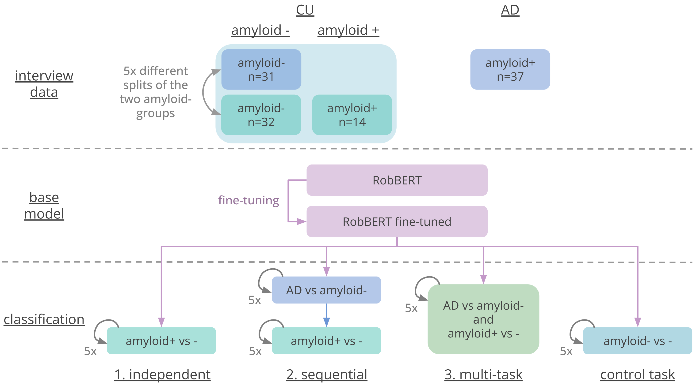

# Connected Speech Classification

<a target="_blank" href="https://cookiecutter-data-science.drivendata.org/">
    
</a>

Classification of Alzheimer's disease and Amyloid Status from Transcribed Connected Speech.

## Installation 

To install the code, do the following:

```
pip install git+https://github.com/lcn-kul/connected_speech_classification.git
```

Requirements can be installed from the ```requirements.txt``` file doing something like this:

```
conda create --name connected-speech-classification python=3.11
pip install -r requirements.txt
```

## Reproduction of Results



The analysis roughly consists of three steps: Data preparation, classification, formatting of the results. 

### Data Preparation

```
python ./connected_speech_classification/data/prepare_disease_status_datasets.py prepare-ad-hc-amyloid-pos-neg-datasets
```
### Running the Models

1. Independent classification 

1.1 Classification on AD vs half of amyloid negative HC

```
python ./connected_speech_classification/models/disease_status_classifier classify-disease-label
```

1.2 Classification of amyloid positive vs other half of amyloid negative HC

```
python ./connected_speech_classification/models/disease_status_classifier classify-disease-label --classify_amyloid
```

1.3 Classification of amyloid negative group 1 versus amyloid negative group 2

```
python ./connected_speech_classification/models/disease_status_classifier classify-disease-label --classify_baseline
```

2. Sequential classification
Make sure to get the saved model ```"your-saved-model"```.

```
python ./connected_speech_classification/models/disease_status_classifier.py classify-disease-label \
	--classification_model_base "your-saved-model" \
	--classify_amyloid
```

3. Joint multi-task classification

In this case, you need to provide two dataset directories.
```
python ./connected_speech_classification/models/disease_status_classifier.py classify-disease-label \
	--classify_jointly \
    --dataset_dir "your-ad-dataset" \
    --dataset_dir "your-amyloid-dataset"
```

### Formatting the Results

This assumes that the mlflow database has been exported to a ```.csv``` file.

```
python ./connected_speech_classification/evaluation/format_mlflow_results.py convert-mlflow-tables
```

### Combined Script

For convenience, there are scripts in ```scripts/combined```, but they might need some additional changes.